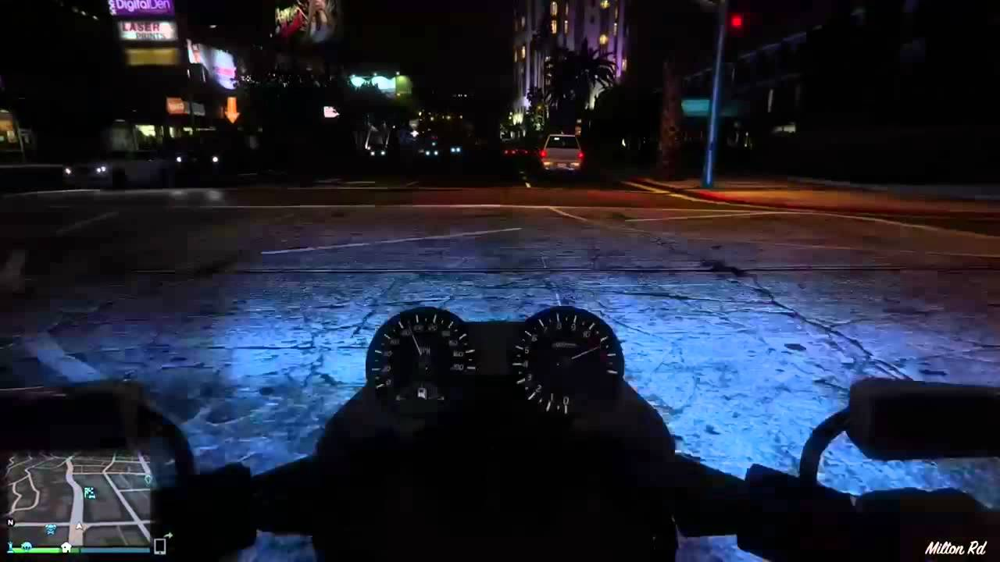
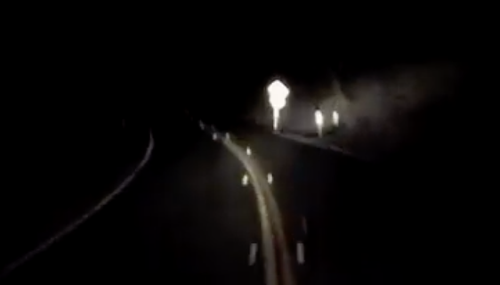
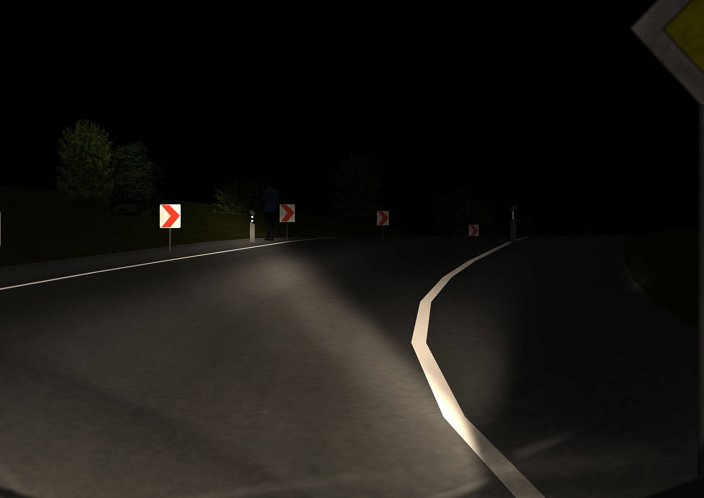

# :monocle_face: Dallas Dominguez :monocle_face:
#### PID: A16050696
# :stuck_out_tongue_closed_eyes: Samuel Liimatainen :stuck_out_tongue_closed_eyes:
#### PID: A16591201
# :sunglasses: Zhe Mo :sunglasses:
#### PID: A15538969

#### ECE16 - WI22

## Lab 3: Beyond DIY

In this lab, we were tasked with beginning the initial stages of our final project.
Our objective was to identify some sort of problem we have in our daily lives and present it to the class.
After the presenations, our team was assigned a problem proposed by our fellow classmate Teo Maldanado (ECE-UCSD).

### Diving into The Problem

Often times engineers cannot foresee certain issues with their designs, which is why design is an iterative process
in itself. In the presentations, Teo raised an issue he had with a recent purchase he made. He had bought a [Honda Grom](https://en.wikipedia.org/wiki/Honda_Grom)
for getting to and from school, and has been happy with the purchase he made. However Teo, being the hard working engineering student he is, often times has to stay
late on campus in order to get his assignments finished. As Teo began his nightly treks back home on this motorcycle, he began to notice that the bike did not sufficiently
light up the road where it needed to. Yes, the Grom comes equipped with an LED projector-style headlight, which does a great job at lighting the road **directly in front** of the
motorcyclist. But a serious issue comes to surface when taking the bike through a corner.

Typical motorcycle headlights are designed in a way that lights everything below a certain horizon level. While this has been a tried and true design for many years, it has its blatant flaws.
This 'horizon-style' design produces issues when a motorcyclist want to turn a corner. The horizon line often dips well below a comfortable zone, and effectively leaves a giant blind spot for
the motorcyclist, putting them and other road patrons at a high risk of danger.

Here is how motorcycle headlights are typically designed: (Notice the clear horizon)

And here are some clearer images of the problem: (Notice the huge darkzones on one side)

Here is a short [video](https://youtu.be/hbu-KYSNYqo) demonstrating the problem in action. 
The narrator says it best when he states, **"the horizon dips, and you can't see a damn thing!"**

This is a serious issue, and in order to keep our buddy Teo safe out there on the roads at night,
we have taken it upon ourselves to build him a solution to this problem.

### Diving into the Research :books: :bar_chart:

We set up an interview with Teo where we got to ask him some more detailed questions on the issue
after he pitched it in class. Here is what we asked:

:one: **Describe your need?**\

As Teo makes a turn on his motorcycle at night, his headlight does not sufficiently illuminate his path of travel. This is especially true when making left or right banking turns.  Teo needs a way to illuminate the dark part of the road in a turn so he doesn't hit potholes or animals. 

:two: **Describe when the problem happens?**\
	The problem happens at night time, when the road banks to the left or right.

:three: **How do you currently satisfy your need?**\
Teo turns on the high-beam so that it extends the field of view and he can capture the beginning of the approaching turn better. 

:four: **What are the disadvantages of the current method?**\
Turning on the high beam can momentarily blind other drivers, so it can potentially be dangerous.

:five: **Why is this need important to you?**\
Teo’s mom takes his safety very seriously, so seeing the details of the road while making a turn on his motorcycle is very important. 

:six: **If timeline or budget were not constraints, what would your ideal solution look like?**\
	Prolly a level headlight.

:seven: **How can we make the implementation of a solution as easy as possible?**\
Attachment I could place under my headlight without damaging the bike. Don’t worry about how to attach it, testing can happen on a bicycle. 

:eight: **What would you be willing to try out?**\
	This is a little vague. Anything that I wouldn’t have to drill holes to make work.

:nine: **What have you tried in the past to fix this problem?**\ 
	Nothing. 

:one::zero: **How long have you been thinking about this problem?**\
	Since the first few weeks of owning the bike, ~7/21.

Based on Teo's responses, we created a survey to get input from Teo and others on proposed design concepts and ideas:

https://docs.google.com/forms/d/e/1FAIpQLSdcDxXjVpJflPnE3a27_mBpkgb0WT4i7eC_Uifkb58sn2eZGw/viewform?usp=sf_link

Based on the results, we can see that many people do in fact find this to be a large issue. We also found interesting metrics like how some people don't view
this problem as a danger, and that most people don't like very bright LED lights. We will have to factor this into the design as we move forward.

