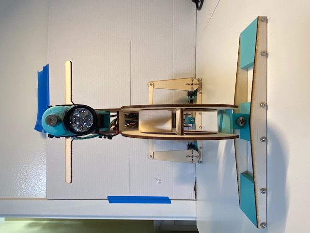
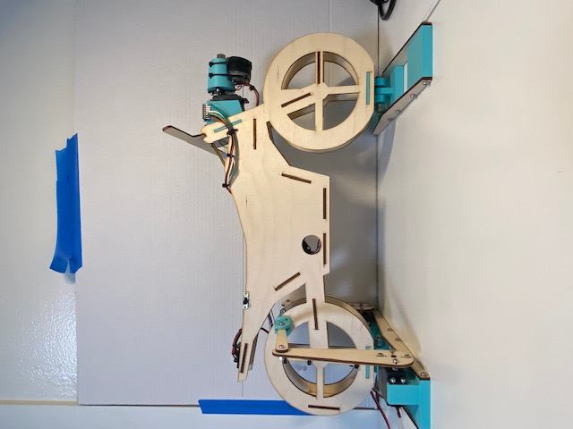
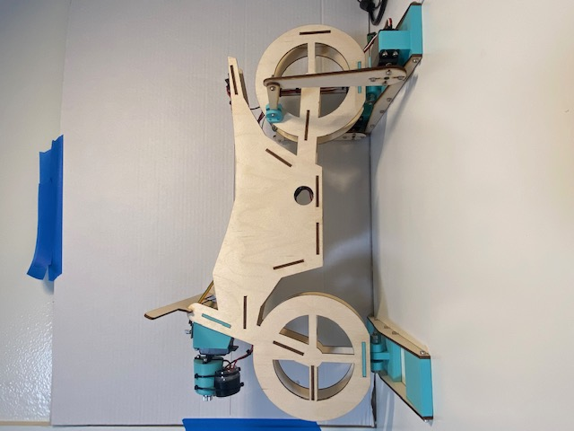
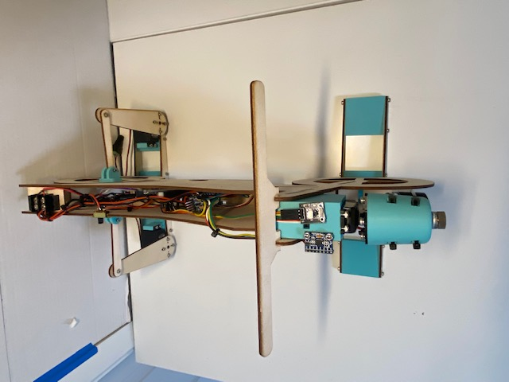

# :monocle_face: Dallas Dominguez :monocle_face:
#### PID: A16050696
# :stuck_out_tongue_closed_eyes: Samuel Liimatainen :stuck_out_tongue_closed_eyes:
#### PID: A16591201
# :sunglasses: Zhe Mo :sunglasses:
#### PID: A15538969

#### ECE16 - WI22

## Lab 8: Design/Build, Use/Test

### Challenge 1: Customer Feedback + User Observation  
#### Iteration 1  
**Current State of the prototype**:  
- The system can detect rotation about an axis  
- The data from the rotation sensor is being fed to a servo which counteracts the rotation  

**Our prototype is a servo that counter rotates the motion of the MPU6050 sensor.**  

**Questions for the customer:**  
- Does this seem like the ___range of motion___ will work for you?  
  - 180 deg is more than enough he says  
- Does the ___speed of the rotation___ seem like it will work for you?  
  - Speed of rotation is good, he thinks the system will be able to correct fast enough  
- Do you see this solution working to ___solve your needs___?  
  - yes he could see this system solving his problem  
- If you picture a light mounted to this stabilized prototype, do you picture this system being able to stabilize the light beam across the horizon?  
  - yes, he agrees that this prototype will lead to a final solution that he is looking for  

**Improvement**:  
We want to find a headlight that can demonstrate the ability to stay level. Ideally, it has a semicircular area of illumination, and can be mounted on our prototype.  
 
#### Iteration 2  
**Current State of the prototype**:  
- The system can detect rotation about an axis  
- The data from the rotation sensor is being fed to a servo which counteracts the rotation  
- The laser level light is mounted to the servo to demonstrate the level  
- The LED light s mounted to the servo  

**Our prototype is a servo that counter rotates the motion of the MPU6050 sensor.**  
**The customer is satisfied with this design.**  
We now can visualize the stabilization of the headlight when the bike is "cornering".  
See Next Section  

  
### Challenge 2: System Characterization of Measurable Metrics  
**Charateristic and its rationale**  
The most important characteristic of our prototype is ___the ability to keep level___.  
Because we seek to imitate the functionality of the ALLight self-stabilizing headlight, we want our prototype to stay the level. When the motorcycle enters a corner, without an adaptive cornering light, the road in the inner corner cannot be illuminated. BMW and Yamaha turn on additional LED to illuminate the road, while ALLight keeps the light level. The functionality of the ALLight has been demonstrated in previous assignments. Therefore, the most important characteristic of our prototype is ___the ability to keep level___.  

**Iteration 1**   
In this iteration, we feed the collected angle information from MUP6050 to the servo which counteracts the rotation. However, since we don't have any equipment (such as a headlight) to show the actual performance of the servo, we print the calculated angle on the Serial Monitor. The result shows that the servo can well keep the level.  
Further, we brought the MPU6050 to the class and showed how fast it read the angle.  

**Iteration 2**  
In the second iteration, we have the laser level line, so it helps to read the real angle. We project the laser level line on the wall, and measure the angle with and without the stabilization.  
  
  
  
From the above plots, we can clearly see that without stabilization, the laser angle is almost the same as the bike angle which is controlled by the skeleton. This demonstrates that the light level is changed and this simulates the condition when cornering. When testing with stabilization, the laser angle is almost at level (90 degrees), and this demonstrates the functionality of our prototype.  

**Because our prototype is good enough, we only have 2 iterations**  

### Challenge 3: Final Prototype Demo Video  

Describe how it work: 
The final product that our team has arrived at utilizes a servo to stabilize the projected beam of light. We mounted a light and a red laser cross so that the client could visually see the results of our product. The light and laser are mounted to a platform which is stabilized across the roll axis of motion, this allows the light to remain locked on the horizon as the bike leans side to side. We also designed an original demo to further help the client see how the proposed solution can satisfy their needs.   

The rationale that has led to this final design: 
Two main contributing factors led to this final design. One being the observation of products and designs that have served to solve similar problems. The second contributing factor that led us to our final design is the ability to take advantage of the fact that a motorcycle rolls side to side on a fixed axis the majority of the time, and we can leverage single axis stabilization to counteract that roll.   

How does it achieve the customer’s needs?: 
Our final product achieves the customers needs by providing a lighting system that does not roll with the frame of the motorcycle, but instead remains locked on the same axis as the road. This allows the rider to always have maximum light spread on the road ahead, regardless of the bike's maneuvers. As a result this solves our clients needs.   

What are its system characteristics?: 
The system is built using an MPU6050 sensor which feeds signal data to an Arduino Pro Mini which then processes the incoming signal and outputs the correct servo values to counteract the movement of the MPU6050. These components operate in conjunction with each other to achieve the goal of stabilization. The system is stabilized about one axis, when this axis is parallel to the bike's roll axis, the system's stabilization can be utilized. As the bike rolls side to side, the system counteracts the roll and keeps the light spread across the road.   

As described above, the major functionality of our prototype is keeping the level so that it can illuminate the corner ahead. And unlike a high-beam which can momentarily blind other drivers, this product could be more friendly to other drivers, and thus safer for the customer. In addition, installing this equipment doesn't have to drill additional holes on the motorcycle. Therefore, this prototype achieves the cuustomer's needs.  
**Cornering without Stabilization & ** **Cornering with Stabilization**  

  

